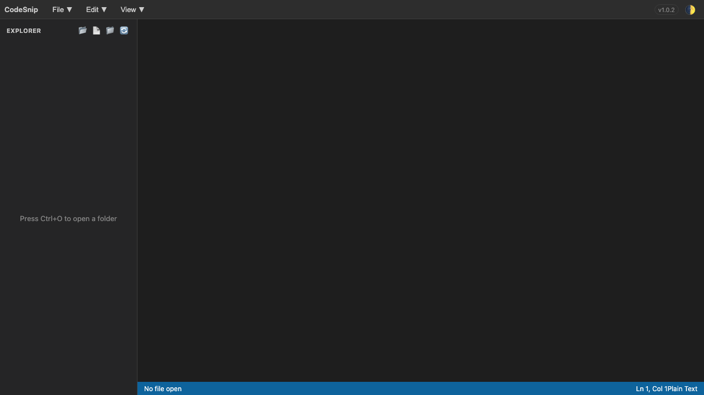

# CodeSnip Editor

Extensão Chrome com editor de código em nova aba, explorador de arquivos e atalhos de produtividade.

## Funcionalidades

- Abrir pasta local e navegar na árvore de arquivos
- Abrir, editar e salvar arquivos
- Criar arquivo e pasta
- Alternar tema claro/escuro
- Menus `File`, `Edit` e `View`
- Quick Open com busca por arquivo (`Cmd+P` no macOS / `Ctrl+P` nos demais)

## Instalação (modo desenvolvedor)

1. Abra `chrome://extensions`
2. Ative `Developer mode`
3. Clique em `Load unpacked`
4. Selecione a pasta deste projeto

## Como usar

1. Clique no ícone da extensão
2. Clique em `Abrir Editor`
3. No editor, clique em `📂` para abrir uma pasta
4. Clique em um arquivo na árvore para editar

## Atalhos

- `Cmd/Ctrl + O`: abrir pasta
- `Cmd/Ctrl + S`: salvar arquivo atual
- `Cmd/Ctrl + N`: novo arquivo
- `Cmd/Ctrl + P`: buscar/abrir arquivo (Quick Open)
- `Cmd/Ctrl + B`: mostrar/ocultar sidebar
- `Cmd/Ctrl + Shift + K`: deletar linha

## Estrutura

- `manifest.json`: configuração da extensão
- `popup/`: popup da extensão
- `editor/`: tela principal do editor
- `icons/`: ícones
- `assets/`: imagens (incluindo screenshot)

## Status

Versão atual no `manifest.json`: `1.0.2`
